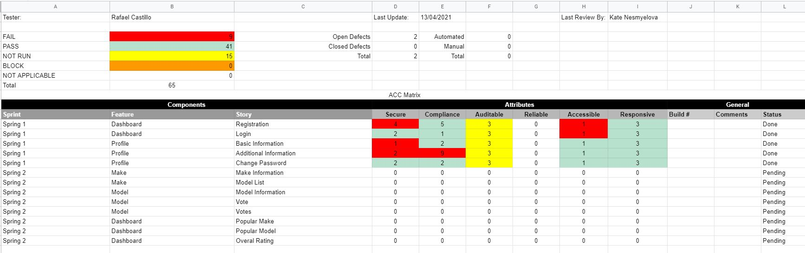
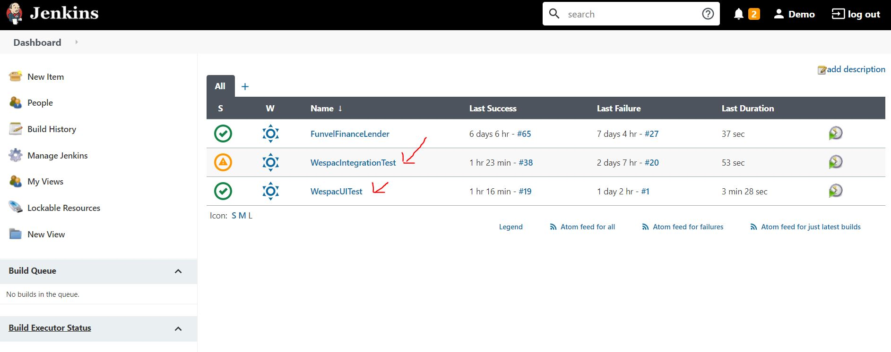
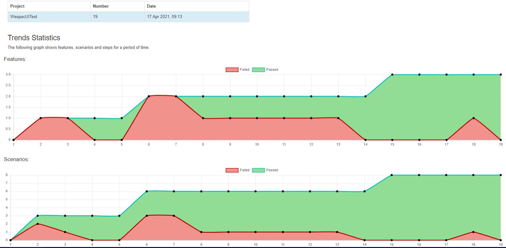
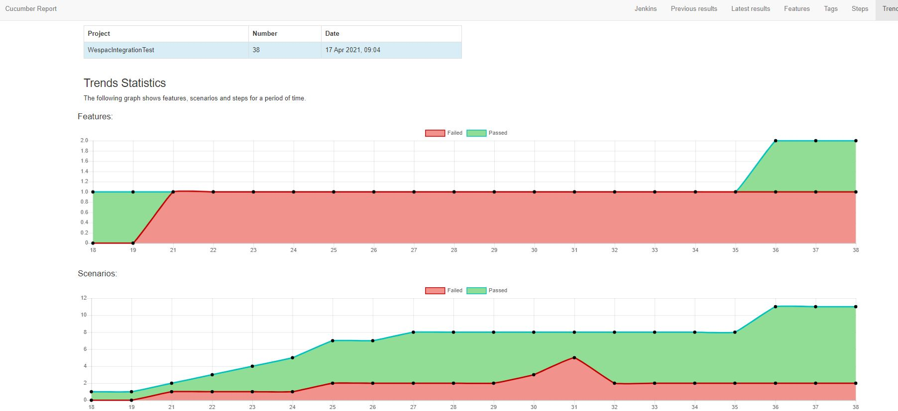

## Senior Automation QE (Rafael)

1. Test approach 
2. Test artifacts (Test plan, scenarios & bug report)
3. Test automation 
4. CI pipeline 

#### 1. Test approach

##### 1.1 Description

Buggy cars rating, is a website where fan vehicles can rate a range of luxurious cars, Users can view and rate multiple car makes and models. 

##### 1.2 Test Approach 

In order to test Buggy cars rating website I am following the ACC (Attribute, component, capability) testing approach, this approach was design by google and its primary objective is to test capabilities over features, I personally find this approach very useful since it helps the team to have common understanding about the product or component

> Note:  
> A capability is the intersection between an attribute and a component, for example we can be testing the Secure attribute of the login component, we can then say the 'Login component is Secure When un-authorized user Do NOT have access to Buggy Car ratings'    

for the testing of Buggy Car Ratings I have used the following attributes: 

- <b>Secure</b>: Focus in finding any type of vulnerability in the application 
- <b>Compliance</b>: Focus in testing any expected results or acceptance criteria
- <b>Auditable</b>: Focus in testing any transaction traceability
- <b>Accessible</b>: Focus in testing the application from the perspective of a person with different abilities   
- <b>Responsive</b>: Focus in testing the application in different browsers and screen dimensions 

#### 2. Test artifacts (Test plan, scenarios & bug report)

**[Download ACC Matrix test artifact](https://github.com/rafcasto/WestPacConsolidateInterview/raw/master/assests/WestPac_ACC_Matrix.xlsx)** 

> Note:  
> This document contains three tabs
> - <b>Summary</b>: 360 view of the overall testing progress, summary of the test execution including number of open/close defects, number of failed capabilities and total number of capabilities or scenarios   
> - <b>Scenarios</b>: Details of each capability/scenario that has been tested, I also have added few comments on the capabilities that have failed
> - <b>Defects</b>: this tabs contains a bug report, document is ready to perform a defect triage and keep record of the team conversation around each defect, collaboration is key :)   

#### 3. Test automation

##### 3.1 Test strategy  

For this use case I have made use of the testing quadrant and test pyramid, I have break the automation in two projects, one project focus in integration testing validating the API, and the other testing focus at UI or functional level, testing user interactions, since UI test tends to add more cost and maintenance effort, is always a good practice to cover critical functionalities at integration level and use UI automation as functional testing support. 

##### 3.2 Automation projects can be found: 
 
- **[Integration Test](https://github.com/rafcasto/WespacIntegrationTest)**
- **[UI Test](https://github.com/rafcasto/WestpacUITest)**     

> Note:  
> Setup instructions can be found on each project 

#### 4. CI pipeline

Jenkins pipelines have been set up for each regression project

1. *[Jenkins](http://222.153.60.98:49002/)* 
2. Login: demo
3. password: password

##### 4.1 Reporting

1. *[Integration Test Report](https://github.com/rafcasto/WestPacConsolidateInterview/tree/master/assests/IntegrationTestReport)* 
1. *[UI Test Report](https://github.com/rafcasto/WestPacConsolidateInterview/tree/master/assests/UITestReport)*

 ###### 4.1.1 Trend Reports
  
 ###### UI Test jenkins trend report
  
 
 
 ###### Integration Test jenkins trend report
    
 
